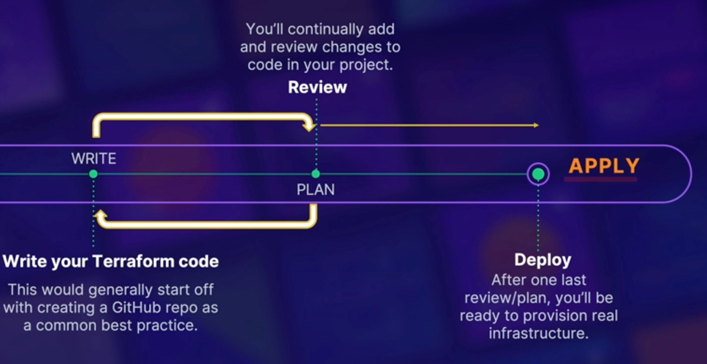
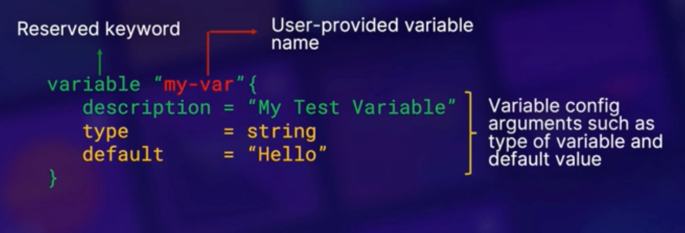

# HashiCorp Certified Terraform Associate

**CHAPTER 1**
- **Introduction**
    - Introduction
    - Exam Blueprint
    - Why Get Terraform Certified?

**CHAPTER 2**
- **Understanding Infrastructure As Code**
    - IaC and Its Benefits
    - Cloud Agnostic IaC with Terraform
    - Chapter Quiz: Understanding IaC

**CHAPTER 3**
- **IaC with Terraform**
    - What is the Terraform Workflow?
    - Terraform Init (Initializing the Working Directory)
    - Terraform Key Concepts: Plan, Apply, and Destroy
    - Resource Addressing in Terraform: Understanding Terraform Code
    - Deploying a VM in AWS Using the Terraform Workflow
    - Chapter Quiz: IaC with Terraform

**CHAPTER 4**
- **Terraform Fundamentals**
    - Installing Terraform and Terraform Providers
    - Terraform State: The Concept
    - Terraform Variables and Outputs
    - Terraform Provisioners: When to Use Them
    - Installing Terraform and Working with Terraform Providers
    - Using Terraform Provisioners to Set Up an Apache Web Server on AWS
    - Chapter Quiz: Terraform Fundamentals

**CHAPTER 5**
- **Terraform State**
    - Terraform State Command
    - Local and Remote State Storage
    - Demo: Persisting Terraform State in AWS S3
    - Exploring Terraform State Functionality
    - Chapter Quiz: Terraform State

**CHAPTER 6**
- **Terraform Modules**
    - Accessing and Using Terraform Modules
    - Interacting with Terraform Module Inputs and Outputs
    - Building and Testing a Basic Terraform Module
    - Chapter Quiz: Terraform Modules

**CHAPTER 7**
- **Built-in Functions and Dynamic Blocks**
    - Terraform Built-in Functions
    - Terraform Type Constraints (Collections & Structural)
    - Terraform Dynamic Blocks
    - Using Terraform Dynamic Blocks and Built-in Functions to Deploy to AWS
    - Chapter Quiz: Built-in Functions and Dynamic Blocks

**CHAPTER 8**
- **Terraform CLI**
    - Terraform fmt, taint, and import Commands
    - Terraform Workspaces
    - Debugging Terraform
    - Practicing Terraform CLI Commands (fmt, taint, and import)
    - Using Terraform CLI Commands (workspace and state) to Manipulate a Terraform Deployment
    - Chapter Quiz: Terraform CLI

**CHAPTER 9**
- **Terraform Cloud and Enterprise**
    - Section Intro
    - Benefits of Sentinel (Embedded Policy-as-Code Framework)
    - Best Practice: Terraform Vault Provider for Injecting Secrets Securely
    - Benefits of Terraform Registry and Terraform Cloud Workspaces
    - Differentiating Between Terraform OSS and Terraform Cloud Workspaces
    - Benefits of Terraform Cloud (Summary)
    - Section Summary
    - Chapter Quiz: Terraform Cloud and Enterprise

**CHAPTER 10**
- **Conclusion**
    - Wrapping It All Up - Summary


<br><br><br><br>


## Chapter 2<br>Understanding Infrastructure As Code

### laC and Its Benefits
Infrastructure as Code (IaC) is a key DevOps practice that involves managing and provisioning computing infrastructure through machine-readable definition files, rather than through physical hardware configuration or interactive configuration tools. It allows for the automation of infrastructure setup, configuration, and management processes, leading to more efficient, consistent, and scalable operations.

#### Key Concepts of IaC

1. **Declarative vs. Imperative**:
   - **Declarative**: You define the desired state of your infrastructure, and the IaC tool (like Terraform) takes care of achieving that state. Terraform uses this approach.
   - **Imperative**: You write commands that specify the steps to achieve the desired state. Tools like Ansible can use this approach.

2. **Version Control**:
   - Treat infrastructure configurations as code that can be versioned and managed using version control systems like Git. This allows for tracking changes, collaborative development, and rollback capabilities.

3. **Idempotency**:
   - IaC ensures that applying the same configuration multiple times will produce the same result. This means you can safely reapply configurations without causing unintended changes or errors.

4. **Automation**:
   - IaC enables automation of the provisioning process, reducing the need for manual intervention and minimizing human errors. This leads to more reliable and repeatable infrastructure setups.

5. **Consistency**:
   - By using code to define infrastructure, you ensure that environments are consistent across different stages of development, testing, and production. This consistency reduces "configuration drift" and improves stability.

#### Benefits of IaC

- **Speed and Efficiency**: Automating infrastructure setup and management accelerates deployment times and improves operational efficiency.
- **Scalability**: IaC makes it easier to scale infrastructure up or down by simply modifying the configuration code.
- **Reproducibility**: Environments can be reproduced reliably and consistently, which is crucial for development, testing, and production.
- **Collaboration**: Teams can collaborate on infrastructure code using version control, making it easier to review, discuss, and approve changes.
- **Documentation**: IaC code serves as documentation for your infrastructure setup, making it easier to understand and manage.

#### Popular IaC Tools

- **Terraform**: A tool by HashiCorp that uses a declarative approach to define and provision infrastructure across various cloud providers.
- **CloudFormation**: An AWS service for defining and managing infrastructure using JSON or YAML templates.
- **Ansible**: A configuration management tool that can also be used for IaC with its playbooks.
- **Puppet**: A configuration management tool that uses a declarative language to define infrastructure configurations.
- **Chef**: A configuration management tool that uses Ruby-based DSL for defining infrastructure as code.

#### Example of Terraform IaC Code

Here’s a simple example of a Terraform configuration to create an AWS EC2 instance:

```hcl
provider "aws" {
  region = "us-west-2"
}

resource "aws_instance" "example" {
  ami           = "ami-0c55b159cbfafe1f0"
  instance_type = "t2.micro"

  tags = {
    Name = "example-instance"
  }
}
```

In this example:
- The `provider` block specifies the AWS region.
- The `resource` block defines an AWS EC2 instance with a specific AMI and instance type.


<br><br><br>


### Cloud Agnostic IaC with Terraform

**Overview**:
Terraform is a powerful tool for codifying configurations for software-defined networks (SDNs) and infrastructure deployments, enabling DevOps and cloud-agnostic operations.

**Key Features of Terraform**:

1. **Software-Defined Networks (SDNs)**:
   - Terraform allows the configuration of SDNs, such as AWS Virtual Private Cloud (VPC), using HashiCorp Configuration Language (HCL).
   - Enables developers to manage networks as code, integrating seamlessly into DevOps workflows.

2. **Versatility and Uniformity**:
   - Terraform interfaces with various cloud and infrastructure vendor APIs, as well as resource schedulers like Kubernetes.
   - Uses a uniform language (HCL) across different platforms, providing a consistent user experience regardless of the deployment environment.

3. **Cloud Agnostic**:
   - Terraform supports a wide range of cloud and infrastructure vendors, making it agnostic to specific cloud providers.
   - Facilitates high availability solutions across multiple public clouds (e.g., AWS and GCP) beyond the capabilities of a single vendor.

4. **Provider Ecosystem**:
   - Extensive and growing library of providers for major public clouds (AWS, Azure, Alibaba, VMware, Oracle) and other services (DigitalOcean, Fastly, Gridscale, Heroku).
   - Includes providers for databases (MySQL, InfluxDB) and more, showcasing the active community and broad interfacing capabilities.

5. **State Management**:
   - Terraform’s state tracking mechanism centralizes dependency and resource tracking.
   - Simplifies infrastructure changes by handling modifications automatically to achieve the desired state.
   - Example: Changing the OS image of a cloud VM is managed by Terraform, which handles the deletion of the old VM and provisioning of the new one, reducing manual effort and errors.

**Benefits of Using Terraform**:
- Automates infrastructure provisioning and management, saving time and reducing human error.
- Promotes high availability and disaster recovery through multi-cloud deployments.
- Supports a diverse and expanding range of cloud services and providers.
- Ensures consistent and repeatable infrastructure setups with its declarative approach.


<br>

#### How Terraform Achieves Cloud Agnosticity

Terraform achieves cloud agnosticity by interfacing with the APIs of various cloud providers and infrastructure tools. This design enables users to write a single, uniform configuration in HashiCorp Configuration Language (HCL) to manage resources across multiple clouds. The core components that facilitate this capability are:

1. **Providers**:
   - Providers are plugins that enable Terraform to interact with different cloud platforms and services. Each provider is responsible for understanding the API of the service it manages.
   - For example, the AWS provider knows how to create, update, and delete AWS resources by making appropriate API calls to AWS services. Similarly, the Azure provider interacts with Azure APIs, and so on.

2. **Provider Plugins**:
   - Each provider plugin translates Terraform’s declarative configuration into API calls specific to the cloud provider or tool it supports.
   - This abstraction layer allows users to define infrastructure resources in a consistent manner, regardless of the underlying platform.

3. **Unified Configuration Language (HCL)**:
   - Terraform’s HCL allows users to define infrastructure resources in a consistent, human-readable format.
   - The same HCL code can be used to describe resources for different providers, making the configuration portable across different environments.

4. **State Management**:
   - Terraform maintains a state file that tracks the current state of the managed infrastructure. This state file is essential for mapping the declared resources in HCL to the actual resources in the cloud provider.
   - The state management system helps Terraform understand the existing infrastructure and apply changes incrementally, regardless of the provider.

#### Example

A simple example of a Terraform configuration that is cloud-agnostic might look like this:

```hcl
provider "aws" {
  region = "us-west-2"
}

provider "google" {
  project = "my-project"
  region  = "us-west1"
}

resource "aws_instance" "example" {
  ami           = "ami-0c55b159cbfafe1f0"
  instance_type = "t2.micro"
}

resource "google_compute_instance" "example" {
  name         = "example-instance"
  machine_type = "f1-micro"
  zone         = "us-west1-a"

  boot_disk {
    initialize_params {
      image = "debian-cloud/debian-9"
    }
  }

  network_interface {
    network = "default"
  }
}
```

In this configuration:
- The `provider "aws"` block sets up the AWS provider.
- The `provider "google"` block sets up the Google Cloud provider.
- The `resource "aws_instance" "example"` block defines an AWS EC2 instance.
- The `resource "google_compute_instance" "example"` block defines a Google Compute Engine instance.

Despite the differences in cloud providers, the configuration syntax remains consistent, and Terraform handles the underlying API interactions specific to each provider.

#### Conclusion

Terraform’s cloud-agnostic approach is made possible by its use of provider plugins that interact with cloud provider APIs. This design allows users to define infrastructure as code in a consistent manner, making it easier to manage multi-cloud environments and achieve high availability and flexibility.


<br><br><br><br>


## Chapter 3 <br>IaC with Terraform
### Terraform Workflow

#### Overview
The Terraform workflow involves three primary phases: writing code, reviewing changes, and executing the code to deploy infrastructure. This structured approach ensures efficient and reliable infrastructure management.

#### Workflow Phases

1. **Write Phase**:
   - **Objective**: Develop the initial Terraform configuration.
   - **Best Practices**:
     - **Version Control**: Use a version control system (e.g., Git) to manage your Terraform code. This facilitates collaboration and iterative improvements.
     - **Flat Files**: For individual work, you might start with flat files, but version control is still recommended for tracking changes.

2. **Plan Phase**:
   - **Objective**: Review the changes that the Terraform configuration will make.
   - **Details**:
     - Run the `terraform plan` command to see a detailed preview of the changes Terraform will apply.
     - This step allows you to verify the planned changes and ensure they align with your expectations.
     - Modify the code based on the plan output to perfect your configuration.

3. **Apply Phase**:
   - **Objective**: Execute the Terraform configuration to deploy infrastructure.
   - **Details**:
     - Run the `terraform apply` command to apply the changes and create real resources in the cloud.
     - This step makes actual changes to the environment, deploying the specified infrastructure.

#### Workflow Summary
- **Write**: Develop Terraform configurations using best practices such as version control.
- **Plan**: Preview and review the changes to be made by Terraform without deploying them.
- **Apply**: Execute the configuration to create and manage infrastructure.

#### Example Workflow

1. **Write Code**:
   - Develop Terraform configuration files (`*.tf`).

   ```hcl
   provider "aws" {
     region = "us-west-2"
   }

   resource "aws_instance" "example" {
     ami           = "ami-0c55b159cbfafe1f0"
     instance_type = "t2.micro"
   }
   ```

2. **Plan Changes**:
   - Run `terraform plan` to see the planned changes.

   ```shell
   $ terraform plan
   ```

   - Review the output to understand what resources will be created, modified, or destroyed.

3. **Apply Changes**:
   - Run `terraform apply` to apply the configuration.

   ```shell
   $ terraform apply
   ```

   - Confirm the apply action to deploy the infrastructure.


<br><br><br>


### Terraform Init (Initializing the Working Directory)

#### Overview

`terraform init` is a fundamental command in the Terraform workflow. It initializes the working directory containing your Terraform configuration files, preparing it for use by downloading necessary components and setting up the backend.

#### Key Functions of `terraform init`

1. **Downloading Providers**:
   - Providers are plugins that enable Terraform to interact with various cloud services and APIs. `terraform init` downloads the providers specified in your configuration, ensuring the necessary libraries and code are available for your resources to make API calls.

2. **Fetching Modules**:
   - Modules are reusable configurations that can be called within your Terraform code. `terraform init` retrieves these modules from the Terraform Registry or custom URLs, caching them locally for use in your project.

3. **Setting Up Backend**:
   - The backend is a configuration that specifies where Terraform's state data is stored. `terraform init` sets up this backend, which is crucial for tracking the state of your resources. The state file allows Terraform to manage resource creation, updates, and deletions.

#### Workflow

1. **Command Execution**:
   - Run `terraform init` in the directory containing your Terraform configuration files.

   ```shell
   $ terraform init
   ```

2. **Provider and Module Initialization**:
   - `terraform init` checks for the providers and modules specified in your configuration files.
   - It downloads these components from the Terraform Registry or custom URLs, caching them locally.
   - If a newer version of a module or provider is available, `terraform init` will download and install the latest version by default.

3. **Backend Configuration**:
   - Configures the backend for storing the Terraform state file, which is essential for resource management.

#### Example

Consider the following Terraform configuration that specifies an AWS provider and a module:

```hcl
provider "aws" {
  region = "us-west-2"
}

module "s3_bucket" {
  source = "terraform-aws-modules/s3-bucket/aws"
  version = "2.0.0"

  bucket = "my-tf-test-bucket"
  acl    = "private"
}
```

Running `terraform init` in the directory with this configuration file will:

- Download the AWS provider plugin.
- Fetch the `s3-bucket` module from the Terraform Registry.
- Set up the local backend for state management.

```shell
$ terraform init
```

#### Additional Functionality

`terraform init` supports several flags and options to customize its behavior. Some of the useful options include:

- `-backend-config`: Specifies additional backend configuration settings.
- `-from-module`: Clones an existing Terraform configuration from a module source.
- `-upgrade`: Upgrades modules and providers to the latest version.

#### Conclusion

`terraform init` is a critical step in the Terraform workflow, preparing your working directory by downloading necessary providers and modules, and configuring the backend for state management. It ensures that your Terraform environment is ready for further actions, such as planning and applying configurations. Understanding and properly utilizing `terraform init` is essential for effective Terraform project management.


<br><br><br>


### Terraform Key Concepts: Plan, Apply and Destroy


#### Overview

Terraform's core workflow revolves around three key commands: `plan`, `apply`, and `destroy`. These commands are essential for managing the lifecycle of infrastructure as code (IaC) using Terraform.

#### Terraform Core Workflow



1. **Write Phase**:
   - Develop the initial Terraform configuration code.

2. **Plan Phase**:
   - Use `terraform plan` to review the changes that the code will make.
   - Iterate between writing and planning to refine and perfect the configuration.

3. **Apply Phase**:
   - Execute the code with `terraform apply` to deploy the actual infrastructure.

#### Key Commands

1. **terraform plan**

   **Description**:
   - Generates an execution plan, showing what actions Terraform will take to achieve the desired state defined in the configuration files.
   - This command is read-only and makes no changes to the actual environment.

   **Functionality**:
   - Validates the configuration and prepares the execution plan.
   - Authenticates with the credentials of the target platform.
   - Allows users to review the planned actions before any resources are created, modified, or destroyed.

   **Usage**:
   ```shell
   $ terraform plan
   ```

   **Benefits**:
   - Enables both individuals and teams to review and vet the planned changes.
   - Helps identify and prevent unforeseen resource deployments.

2. **terraform apply**

   **Description**:
   - Executes the actions proposed in the plan, applying the configuration to deploy infrastructure.

   **Functionality**:
   - Creates, updates, and deletes resources as specified in the Terraform configuration.
   - Updates the Terraform state file (`terraform.tfstate`), which tracks the current state of the managed infrastructure.

   **Usage**:
   ```shell
   $ terraform apply
   ```

   **State File**:
   - Essential for Terraform's operation, the state file records the details of resources created and is referenced in subsequent operations.
   - Can be stored locally or remotely, with the default name `terraform.tfstate`.

3. **terraform destroy**

   **Description**:
   - Destroys the infrastructure managed by Terraform, as defined in the state file.

   **Functionality**:
   - Reads the state file and removes all tracked resources.
   - Should be used with caution, as it is irreversible.

   **Usage**:
   ```shell
   $ terraform destroy
   ```

   **Benefits**:
   - Simplifies cleanup of resources, ensuring uniform deletion of infrastructure.
   - Saves time by eliminating the need for custom scripts to remove resources.

#### Summary

- **terraform plan**: Reviews the code and shows the planned changes.
- **terraform apply**: Deploys and manages the infrastructure, updating the state file.
- **terraform destroy**: Cleans up and deletes all tracked resources.

These commands align with the Terraform core workflow and are crucial for effective infrastructure management. To reinforce these concepts, a hands-on lab is available at the end of this section.

### Hands-on Lab

To practice these commands and understand the Terraform workflow better, be sure to complete the hands-on lab provided at the end of this section. This will give you practical experience in using `terraform plan`, `terraform apply`, and `terraform destroy`.


<br><br><br>


### Resource Addressing in Terraform and Understanding Terraform Code

#### Overview

This lesson introduces the fundamental concepts of Terraform code, focusing on resource addressing. We'll explore provider blocks, resource blocks, and data source blocks, which are essential for defining and managing infrastructure with Terraform.

#### Provider Block

A provider block configures the necessary providers for Terraform to interact with different cloud platforms. Providers abstract away the API calls under the hood.

##### Example: AWS Provider

```hcl
provider "aws" {
  region = "us-west-2"
}
```

- **Keyword**: `provider`
- **Provider Name**: `aws`
- **Configuration Parameters**: Arguments for the AWS provider, such as `region`.

##### Example: GCP Provider

```hcl
provider "google" {
  credentials = file("path/to/credentials.json")
  project     = "my-gcp-project"
  region      = "us-central1"
}
```

- **Keyword**: `provider`
- **Provider Name**: `google`
- **Configuration Parameters**:
  - `credentials`: Path to the authentication credentials file.
  - `project`: GCP project ID.
  - `region`: GCP region.

#### Resource Block

A resource block defines a resource that Terraform will create and manage. Each resource is associated with a provider.

##### Example: AWS EC2 Instance

```hcl
resource "aws_instance" "web" {
  ami           = "ami-0c55b159cbfafe1f0"
  instance_type = "t2.micro"
}
```

- **Keyword**: `resource`
- **Resource Type**: `aws_instance`
- **Resource Name**: `web`
- **Configuration Arguments**:
  - `ami`: Amazon Machine Image ID.
  - `instance_type`: EC2 instance type.

**Accessing Resource Attributes**:

To access attributes of the resource within Terraform code:

```hcl
aws_instance.web.id
```

#### Data Source Block

A data source block fetches data from existing resources, allowing you to reference and use this information in your Terraform configuration.

##### Example: AWS EC2 Instance Data Source

```hcl
data "aws_instance" "my-vm" {
  instance_id = "i-0abcdef1234567890"
}
```

- **Keyword**: `data`
- **Resource Type**: `aws_instance`
- **Resource Name**: `my-vm`
- **Configuration Arguments**:
  - `instance_id`: ID of the existing EC2 instance.

**Accessing Data Source Attributes**:

To access attributes of the data source within Terraform code:

```hcl
data.aws_instance.my-vm.id
```

#### Default Behaviors and Best Practices

- **File Extensions**: Terraform executes code in files ending with `.tf`. Ensure your Terraform code is saved with this extension.
- **Provider Registry**: By default, Terraform sources providers from the [Terraform Registry](https://registry.terraform.io/). Providers can also be sourced locally or from custom locations.
- **Custom Providers**: Terraform supports custom providers, allowing for flexibility in managing infrastructure beyond the default providers.

#### Summary

- **Provider Block**: Configures the necessary providers for interacting with cloud platforms.
- **Resource Block**: Defines resources to be created and managed by Terraform.
- **Data Source Block**: Fetches data from existing resources for reference within Terraform configurations.


<br><br><br><br>


## Chapter 4 <br>Terraform Fundamentals
### Installing Terraform and Terraform Providers

https://developer.hashicorp.com/terraform/install

There are 2 methods to install Terraform:
1. Download, Unzip, Use
   1. Download Zipped Binary from Hashicorp Website
   2. Unzip Terraform Binary
   3. As a best practice, place it in your system's `$PATH`
2. Set up Terraform repository on Linux (only)
   1. Set up a Hashicorp Terraform Repository on Linux (Debian, RHEL, Amazon Linux)
   2. Use package manager to install Terraform
   3. Package manager installs and sets it up so that it is ready to use.

    ```sh
    sudo yum install -y yum-utils
    sudo yum-config-manager --add-repo https://rpm.releases.hashicorp.com/RHEL/hashicorp.repo
    sudo yum -y install terraform
    ```


<br>

#### macOS installation
```sh
brew tap hashicorp/tap
brew install hashicorp/tap/terraform
```


<br>

#### Terraform Providers
- Providers are Terraform's way of abstracting integrations with API control layer of the infrastructure vendors.
- Terraform, by default, looks for Providers in the Terraform providers registry. <br>https://registry.terraform.io/browse/providers
- Providers are plugins. They are released on a separate rhythm from Terraform itself, and each provider has its own series of version numbers.
- You can write your own custom providers as well! (Beyond scope of certification)
- Terraform finds and installs providers when initializing working directory(via terraform init).
- As a best practice Providers should be pegged down to a specific version, SO that any changes across provider version doesn't break your Terraform code.
    ```hcl
    provider "azurerm" {
        version = "2.20.0"
        features {}
    }

    providers "aws" {
        version = "3.7.0"
        region = "us-east-1"
    }
    ```


<br><br><br>


### Terraform State: The Concept

#### Introduction

Terraform state is a fundamental component that enables Terraform to manage infrastructure effectively. Without it, Terraform would not function. This lesson explains the importance of state, its working mechanism, and best practices for managing state files.

#### Importance of Terraform State

**Resource Tracking**: Terraform state is crucial for tracking resources. It allows Terraform to:

1. **Identify Deployed Resources**: Track what has been deployed.
2. **Decision Making**: Determine whether resources need to be created, modified, or destroyed.

#### How Terraform State Works

1. **State File**:
    - A JSON file that maps resources defined in the Terraform configuration to the actual resources in the managed infrastructure.
    - Contains metadata and details about all deployed resources.

2. **State File Utilization**:
    - **Deletion**: When issuing the `terraform destroy` command, Terraform references the state file to identify and delete resources.
    - **Delta Calculation**: Terraform compares the current state (as defined in the state file) with the desired state (as defined in the configuration code) to calculate changes (deltas) and reconcile the infrastructure accordingly.

#### Storing Terraform State

1. **Local Storage**:
    - By default, the state file is stored locally in the same directory as the Terraform code.

2. **Remote Storage**:
    - For better integrity and availability, state files can also be stored remotely using supported backend services like AWS S3, Azure Blob Storage, Google Cloud Storage, etc.

#### Security and Integrity of State Files

1. **Never Lose the State File**:
    - Losing the state file means losing the ability to manage and modify the infrastructure through Terraform, making manual changes cumbersome and error-prone.

2. **Protect the State File**:
    - Ensure the state file does not fall into the wrong hands, as it may contain sensitive information about the deployed resources.

#### Summary

- **Terraform State**: A JSON file that tracks resources and enables Terraform to manage infrastructure.
- **Resource Tracking**: Critical for identifying and managing deployed resources.
- **State File**: Contains metadata and details of resources, helping Terraform calculate and apply changes.
- **Storage**: Can be stored locally or remotely for better availability.
- **Security**: Protect and secure the state file to avoid loss of management capabilities and exposure of sensitive data.


<br><br><br>


### Terraform Variables and Outputs

#### Variables in Terraform
##### Initialization
- 
- Variable declaration snippet
    ```hcl
    variable "my-var" {
        description = "My Test Variable"
        type        = string
        default     = "Hello"
    }
    ```
- All the options within `{}` are optional, so you can declare variable as following: `variable "my-var" {}`. <br>However, in this case you will have to provide value for this variable either through an OS environment variable or a command line input to avoid runtime error. 

##### Referencing
- To use the variable within your configuration you will have to follow format below:
    ```hcl
    var.my-var
    ```
- You can create variables from the main `tf` file, however it is recomended to gather all variables in a separate file `terraform.tfvars` that is picked up by terraform by default.
  

##### Variable validation (available from version 0.13)
- Variable validation allows you to set a criteria for allowed values for a variable:
    ```hcl
    variable "my-var" {
        description = "My Test Variable"
        type        = string
        default     = "Hello"
        validation {
            condition       = length(var.my-var) > 4
            error_message   = "The length must be more than 4 characters"
        }
    }
    ```

##### Sensitive variables
- You can enable a config parameter known as sensitive to prevent Terraform from showing its value during Terraform execution runs, which is the default behavior within Terraform.
    ```hcl
    variable "my-var" {
        description = "My Test Variable"
        type        = string
        default     = "Hello"
        sensitive   = true
    }
    ```


#### Variable Types and Constraints

Terraform supports various types of variables that you can use to parameterize your configurations. These variable types fall into two categories: base types and complex types.

### Base Types

- **`string`**: Represents a sequence of characters.
    ```hcl
    variable "my-string" {
        type    = string
        default = "Hello"
    }
    ```

- **`number`**: Represents numeric values.
    ```hcl
    variable "my-number" {
        type    = number
        default = 42
    }
    ```

- **`bool`**: Represents boolean values (`true` or `false`).
    ```hcl
    variable "my-bool" {
        type    = bool
        default = true
    }
    ```

### Complex Types

- **`list`**: Represents a sequence of values, all of the same type.
    ```hcl
    variable "av-zone-name" {
        type    = list(string)
        default = ["us-west-1a"]
    }
    ```

- **`set`**: Represents a collection of unique values, all of the same type.
    ```hcl
    variable "allowed-ips" {
        type = set(string)
        default = ["192.168.1.1", "192.168.1.2"]
    }
    ```

- **`map`**: Represents a collection of key-value pairs.
    ```hcl
    variable "region-mapping" {
        type = map(string)
        default = {
            "us-east-1" = "US East (N. Virginia)"
            "us-west-1" = "US West (N. California)"
        }
    }
    ```

- **`object`**: Represents a collection of named attributes that each have their own type.
    ```hcl
    variable "docker-ports" {
        type = list(object({
            internal = number
            external = number
            protocol = string
        }))
        default = [
            {
                internal = 8300
                external = 8300
                protocol = "tcp"
            }
        ]
    }
    ```

- **`tuple`**: Represents a sequence of values, where each element has its own type.
    ```hcl
    variable "example-tuple" {
        type = tuple([string, number, bool])
        default = ["example", 123, true]
    }
    ```

<br>

#### Terraform Output - Output Values

Output values in Terraform serve as a way to extract information from your configuration and display it back to the user or use it in other configurations or scripts. Here's a detailed breakdown:

- **Display on CLI**: After a successful `terraform apply` or other execution commands, output values are shown in the terminal. This helps users get immediate feedback about the deployed resources.
  
- **Track and Use Values**: Output values act like return values. They allow you to track and display specific details about your deployed resources, such as IP addresses, resource IDs, or other pertinent information.

##### Example Usage

```hcl
output "instance-ip" {
    description = "VM's Private IP"
    value       = aws_instance.my-vm.private_ip
}
```

In this example, the `output` block named `instance-ip` captures and displays the private IP address of an AWS instance resource named `my-vm`. 

- **description**: (Optional) A human-readable description of what the output value represents.
- **value**: (Mandatory) The value to be returned. This can reference any attribute of the resources defined in your Terraform configuration.

##### Example Configuration with Outputs

Here’s an example of a Terraform configuration with resources and outputs:

```hcl
provider "aws" {
    region = "us-west-1"
}

resource "aws_instance" "my-vm" {
    ami           = "ami-0c55b159cbfafe1f0"
    instance_type = "t2.micro"
}

output "instance-id" {
    description = "ID of the EC2 instance"
    value       = aws_instance.my-vm.id
}

output "instance-ip" {
    description = "Private IP of the EC2 instance"
    value       = aws_instance.my-vm.private_ip
}
```

In this example:

- An AWS EC2 instance is created using the `aws_instance` resource.
- Two outputs are defined:
  - `instance-id`: Captures and displays the EC2 instance ID.
  - `instance-ip`: Captures and displays the EC2 instance's private IP address.

##### Best Practices

- **Naming**: Use descriptive names for your outputs to make it clear what each output value represents.
- **Security**: Be cautious with sensitive information. Avoid exposing sensitive details through outputs that might be displayed in logs or the CLI.
- **Usage in Modules**: Outputs can be particularly useful when using modules, as they allow you to expose and pass necessary information between different parts of your configuration.


<br><br><br>

### Terraform Provisioners: Overview and Best Practices

#### What are Provisioners?

Provisioners in Terraform give users a way to execute custom scripts or commands through Terraform resources. They can be run locally, on the system where Terraform commands are executed, or remotely, on a newly spun-up VM. Provisioners are attached to Terraform resources and allow custom connection parameters to connect to remote resources via SSH or WinRM.

#### Types of Provisioners

There are two types of provisioners:

1. **Create-time Provisioner**: Runs when a resource is being created.
2. **Destroy-time Provisioner**: Runs when a resource is being destroyed.

Provisioners are useful for executing custom one-off automation tasks during these resource lifecycle events.

### Best Practices and Warnings

HashiCorp recommends using provisioners sparingly and only when the underlying vendors (e.g., AWS) do not provide built-in mechanisms for bootstrapping via custom commands or scripts. For instance, AWS allows passing scripts through user data in EC2 virtual machines. If a better inherent method is available, it's best to use that.

Since provisioners can perform any independent action, Terraform cannot track them, breaking Terraform's declarative model. As a result, provisioners are not tracked through Terraform state files.

#### When to Use Provisioners

Use provisioners only when you need to execute actions not covered by Terraform's declarative model or through inherent options for the resources in available providers. Provisioners expect any custom script or command to execute with a return code of 0. Otherwise, the execution is deemed failed, and the resource is marked as tainted, meaning it will be recreated on the next run.

### Provisioner Syntax

#### Create-time Provisioner Example

```hcl
resource "null_resource" "example" {
  provisioner "local-exec" {
    command = "echo 0 > status.txt"
  }
}
```

In this example, a `null_resource` is used with a `local-exec` provisioner that runs a shell command to write `0` to a file named `status.txt`. This provisioner runs during resource creation.

#### Destroy-time Provisioner Example

```hcl
resource "null_resource" "example" {
  provisioner "local-exec" {
    when    = "destroy"
    command = "echo 1 > status.txt"
  }
}
```

This example demonstrates a destroy-time provisioner that writes `1` to the same `status.txt` file upon resource destruction. The `when` parameter is set to `destroy` to specify this.

#### Multiple Provisioners

You can use multiple provisioners against the same resource. They will be executed in the order they are defined.

##### Example: Using Multiple Provisioners

```hcl
resource "null_resource" "example" {
  provisioner "local-exec" {
    command = "echo 0 > status.txt"
  }

  provisioner "local-exec" {
    when    = "destroy"
    command = "echo 1 > status.txt"
  }
}
```

### Demonstration

#### Create and Destroy Resource

In a Linux shell, create a `main.tf` file with the following content:

```hcl
provider "null" {}

resource "null_resource" "example" {
  provisioner "local-exec" {
    command = "echo 0 > status.txt"
  }

  provisioner "local-exec" {
    when    = "destroy"
    command = "echo 1 > status.txt"
  }
}
```

Run the following commands to execute the configuration:

```sh
terraform init
terraform apply -auto-approve
```

After applying, check the `status.txt` file to see the value `0`:

```sh
cat status.txt
# Output: 0
```

Then, destroy the resource:

```sh
terraform destroy -auto-approve
```

Check the `status.txt` file again to see the value `1`:

```sh
cat status.txt
# Output: 1
```

#### Handling Variables in Provisioners

When using variables inside provisioners, be aware of potential cyclical dependencies. To avoid these, use the `self` object to access resource attributes.

#### Example: Using Variables in Provisioners

```hcl
resource "aws_instance" "ec2-virtual-machine" {
  ami           = "ami-0c55b159cbfafe1f0"
  instance_type = "t2.micro"

  provisioner "local-exec" {
    command = "echo ${self.id} > instance_id.txt"
  }
}
```

In this example, `self.id` returns the Amazon Machine Image ID of the EC2 virtual machine, avoiding cyclical dependencies.

#### Summary

Provisioners in Terraform allow executing custom scripts or commands during the resource lifecycle. While powerful, they should be used sparingly and only when necessary to maintain Terraform's declarative model. Use the `self` object to handle variables within provisioners to avoid cyclical dependencies. 


<br><br><br><br>


## Chapter 5<br>Terraform State

### Terraform State Command

#### Terraform State Overview

Terraform state is extremely important to Terraform. Without tracking the state of infrastructure, Terraform cannot work. It maps real-world resources to resources defined in your Terraform code or configuration. By default, the state is dumped into a file called `terraform.tfstate` locally, but it can be stored remotely in services such as AWS S3 as well.

Before Terraform modifies any infrastructure, it checks and makes sure that the state file is up-to-date with the real deployed infrastructure.

#### Key Functions of Terraform State:
1. **Resource Mapping**: Tracks what resources have been deployed.
2. **Dependency Tracking**: Maintains dependencies between resources.
3. **Performance Optimization**: Acts as a cache to avoid extra API calls to the infrastructure provider.

### The Terraform State Command

The `terraform state` command is a utility for modifying and reading the Terraform state file and is used for advanced state management. Normally, you wouldn't need to mess with the Terraform state file outside of the core workflow of Terraform. However, there are scenarios in which you might want to tweak the state outside of the Terraform plan-apply workflow, such as removing or changing resource attributes that are being tracked by Terraform.

#### Common Use Cases:
- **Advanced State Management**: Modify the state file for advanced management scenarios.
- **Untracking Resources**: Remove a resource so that it's not tracked by Terraform.
- **Viewing Resource Details**: Retrieve and view detailed resource information.

### Common Terraform State Subcommands

- `terraform state list`: Lists all resources tracked by the Terraform state file.
  
  ```sh
  terraform state list
  ```

- `terraform state rm`: Deletes a resource from the Terraform state file, thereby untracking it.
  
  ```sh
  terraform state rm <resource_name>
  ```

- `terraform state show`: Shows the details of a resource and its attributes tracked by Terraform.
  
  ```sh
  terraform state show <resource_name>
  ```

### Demonstration

Let's hop onto a local system for a quick demonstration of the Terraform state command.

#### Sample Code

```hcl
terraform {
  required_providers {
    docker = {
      source = "kreuzwerker/docker"
      version = "~> 3.0.1"
    }
  }
}

provider "docker" {}

resource "docker_image" "centos" {
  name         = "centos:7"
  keep_locally = false
}

resource "docker_container" "centos" {
  image = docker_image.centos.image_id
  name  = "terraform-centos"
  command = ["sleep", "3600"]
}
```

This code pulls the CentOS 7 image and starts a container on your local system.

#### Applying the Configuration

```sh
terraform init
terraform apply
```

#### Listing Resources

```sh
terraform state list
```

Output:
```
docker_image.centos
docker_container.centos
```

#### Showing Resource Details

```sh
terraform state show docker_container.centos
```

Output (truncated for brevity):
```
# docker_container.centos:
resource "docker_container" "centos" {
    name     = "terraform-centos"
    image    = "sha256:...:centos:7"
    ...
}
```

#### Removing a Resource from State

1. Verify the container is running:

   `docker ps`

2. Remove the container from Terraform's state:

   `terraform state rm docker_container.centos`

3. Destroy remaining resources:

   `terraform destroy`

4. Verify the container is still running:

   `docker ps`

### Conclusion

The `terraform state` command is extremely useful for advanced state management. However, it should be used with caution and is recommended for advanced users who understand the implications of modifying the state file.


<br><br><br>


### Local and Remote State Storage

### Local State Storage

1. **Default Behavior**:
   - By default, Terraform saves the state file on the local system from which you are running the Terraform commands. This is useful for individual projects or testing where team collaboration is not a factor.

2. **State File Integrity**:
   - Terraform keeps a local backup of the last known state file after a successful `terraform apply`. This helps in recovering from errors or corruption.

3. **Version Control**:
   - Although not ideal for team collaboration, you can store the local state file in a version control system as a fail-safe.

### Remote State Storage

1. **Collaboration and Availability**:
   - Remote state storage allows multiple team members to access and modify the Terraform state file. This is ideal for team projects and ensures better security and availability.

2. **Supported Backends**:
   - Terraform supports a variety of remote storage backends, such as AWS S3, Google Cloud Storage, and more. This list is continually expanding.

3. **Security and Access Control**:
   - Cloud storage platforms offer robust security policies. For example, AWS S3 bucket policies can manage who can read from or write to the state files.

4. **Distributed Teams**:
   - Remote state storage allows teams from different locations to access and collaborate on the same infrastructure. This is crucial for global teams working on shared Terraform code bases.

#### State Locking (remote state file)

1. **Purpose**:
   - State locking prevents multiple Terraform operations from being executed concurrently, which can lead to state file corruption or conflicts.

2. **Local State Locking**:
   - Enabled by default when you run `terraform apply`.

3. **Remote State Locking**:
   - Supported by some remote backends such as AWS S3, Google Cloud Storage, and Hashicorp's Consul.

#### Using Output Values 

1. **Output Values in State Files**:
   - State files contain the output values defined in your Terraform configuration. These values can be shared and used by other Terraform projects.

2. **Remote Output Sharing**:
   - When the state file is stored remotely, other teams can reference it to get output values (e.g., IP addresses, database details) for their deployments. This facilitates modular and interdependent infrastructure setups.

### Practical Example and Benefits

1. **Scenario**:
   - A team in the US deploys a database using Terraform and saves the state file remotely in AWS S3.
   - Another team in Europe can access this state file, reference the output values (like database IP), and deploy an application that connects to the database.

2. **Advantages**:
   - **Collaboration**: Multiple teams can work on interconnected parts of the infrastructure without conflicts.
   - **Security**: Cloud storage security policies ensure only authorized users can access and modify the state file.
   - **Reliability**: Remote state storage ensures that state files are backed up and available even if the local system fails.

### Conclusion

Local and remote state storage mechanisms in Terraform offer different benefits. Local state is suitable for individual use or testing, while remote state is essential for collaboration, security, and reliability in larger team environments. Features like state locking and output sharing enhance these benefits, making Terraform a powerful tool for managing complex infrastructure across distributed teams.


<br><br><br><br>


## Chapter 6<br>Terraform Modules

### Terraform Modules

#### Introduction
A module in Terraform is a directory containing Terraform configuration files, which allows grouping multiple resources used in your project for code reuse and organization.

#### Purpose of Modules
Modules promote code reuse and avoid redundancy. The directory containing your primary Terraform code is the root module. When invoking other modules, these are called child modules. Inputs can be passed to and outputs retrieved from child modules.

#### Using Modules
Modules can be incorporated into Terraform configurations in several ways:

1. **Public Registry**: Reference modules from the Terraform Public Registry. Terraform downloads these and stores them in a hidden directory.

   ```hcl
   module "vpc" {
     source  = "terraform-aws-modules/vpc/aws"
     version = "2.77.0"
     
     name = "my-vpc"
     cidr = "10.0.0.0/16"
     azs             = ["us-west-1a", "us-west-1b", "us-west-1c"]
     private_subnets = ["10.0.1.0/24", "10.0.2.0/24", "10.0.3.0/24"]
     public_subnets  = ["10.0.101.0/24", "10.0.102.0/24", "10.0.103.0/24"]

     tags = {
       Terraform   = "true"
       Environment = "dev"
     }
   }
   ```

2. **Private Registry**: Host modules in a Private Registry for closed-source or secure configurations.

3. **Local Modules**: Store modules locally and reference them by file path.

   ```hcl
   module "local_module_example" {
     source = "./modules/my_local_module"
     
     parameter1 = "value1"
     parameter2 = "value2"
   }
   ```

#### Referencing a Module
Use the `module` block to reference a module, specifying its source, version, and input parameters.

```hcl
module "example" {
  source  = "path/to/module"
  version = "1.0.0"

  input_variable1 = "value1"
  input_variable2 = "value2"
}
```

#### Best Practices
Specify module versions to prevent unexpected changes from updates. Other parameters include:

- `count`: Creates multiple instances of the module's resources.
- `for_each`: Iterates over complex variables.
- `providers`: Binds specific providers to the module.
- `depends_on`: Sets module dependencies.

#### Inputs and Outputs
Modules accept inputs and return outputs, defined using the `output` block, to be used in the main configuration.

```hcl
output "subnet_id" {
  value = aws_subnet.my_subnet.id
}

resource "aws_instance" "example" {
  ami           = "ami-12345678"
  instance_type = "t2.micro"
  subnet_id     = module.vpc.subnet_id
}
```

#### Consuming Module Outputs
Consume outputs from a child module using the `module` keyword, the module name, and the output variable's name.

```hcl
module "vpc" {
  source  = "terraform-aws-modules/vpc/aws"
  version = "2.77.0"
  ...
}

resource "aws_instance" "example" {
  ami           = "ami-12345678"
  instance_type = "t2.micro"
  subnet_id     = module.vpc.public_subnets[0]
}
```

#### Conclusion
Terraform modules enhance flexibility by enabling code reuse and modularization. Understanding and leveraging modules can streamline your Terraform projects and improve team collaboration. Thank you for your attention to this lesson.


<br><br><br>


### Interacting with Terraform Module Inputs and Outputs

#### Decalaring Module in Code

- Module inputs are arbitrarily named parameters that you pass inside the `module` block.
- These inputs can be used as variables inside the module code.

    ```hcl
    module "my-vpc-module'{ 
        source = . /modules/vpc"
        server-name = 'us-east-1' # <- Input parameter(s) for module
    }
    ```
- Inside module `var.server-name`

<br>

#### Terraform Module Output 
- The outputs declared inside Terraform module code can be fed back into the root module or your main code.
- Output invocation convention in Terraform code

    `module.<name-of-module>.<name-of-output>`

- Inside module:

    ```hcl
    # my-vpc-module
    output "ip_address"{
        value = aws_instance.private_ip
    }
    ```
- In root file:

    `module.my-vpc-module.ip_address`


<br><br><br><br>


## Chapter 7<br>Built-in Functions and Dynamic Blocks

### Terraform Built-in Functions


Terraform provides a range of built-in functions that can significantly enhance the flexibility and dynamism of your Terraform code. These functions come pre-packaged with Terraform, so there’s no need to install additional providers or modules to use them. 

#### Overview of Built-in Functions

- **Pre-defined Functions**: Terraform’s built-in functions are ready to use out-of-the-box. Unlike programming languages, Terraform does not allow the creation of user-defined functions, but the provided functions cover a broad spectrum of needs and are frequently updated.
- **Usage**: These functions can be utilized in various sections of Terraform code, such as resource blocks, data sources, provisioners, and variables.

#### Function Syntax

The syntax for invoking a function in Terraform is similar to other programming languages: pass the function arguments, and it returns a value. This approach allows for writing flexible and dynamic configurations.

#### Example: The `join` Function

Here’s a quick example demonstrating the use of the `join` function in Terraform:

```hcl
variable "project_name" {
  description = "Name of the project"
  type        = string
  default     = "prod"
}

resource "aws_instance" "example" {
  ami           = "ami-123456"
  instance_type = "t2.micro"

  tags = {
    Name = join("-", ["terraform", var.project_name])
  }
}
```

- **`join` Function**: Combines the strings "terraform" and the value of `project_name` (which defaults to "prod") with a hyphen, resulting in `terraform-prod` as the tag value.

#### Testing Built-in Functions with Terraform Console

Terraform includes a command-line utility, `terraform console`, which allows you to interactively test and evaluate expressions and functions without deploying resources.

#### Using the Terraform Console

1. **Launching the Console**: Run `terraform console` to open the interactive console.
2. **Testing Functions**: 
   - **Max Function**: `max(1, 5, 3)` returns `5`.
   - **Timestamp Function**: `timestamp()` returns the current UTC time.
   - **Join Function**: `join("_", ["a", "cloud", "guru"])` returns `a_cloud_guru`.
   - **Contains Function**: `contains(["acloud", "guru", 1, 2, 3], "guru")` returns `true`.

3. **Exiting the Console**: Press `Ctrl+C` or `Ctrl+D` to exit the console.

#### Practical Functions

- **`file` Function**: Reads the content of a file.
- **`max` Function**: Returns the maximum value from a list.
- **`flatten` Function**: Converts a list of lists into a single list.

#### Conclusion

Terraform’s built-in functions are a powerful feature that can help you write more concise and flexible infrastructure code. The `terraform console` tool provides a convenient way to experiment with these functions and understand their behavior before applying them in your configurations.


<br><br><br>


### Terraform Type Constraints (Collections & Structural)

Terraform Type Constraints control the types of variable values that can be passed to your Terraform code. Type constraints ensure that variables are assigned the correct type of data, which can be either primitive or complex types.

#### Primitive Types

Primitive types are single-value types, such as:

- **Number**: Represents numeric values.
  - Example: `replicas = 3`
- **String**: Represents a sequence of characters enclosed in quotes.
  - Example: `name = "cluster2"`
- **Boolean (bool)**: Represents true/false values.
  - Example: `backup = true`

#### Complex Types

Complex types allow for more sophisticated data structures by combining multiple values. These types can be categorized into **collection** and **structural** types.

##### Collection Types

Collection types allow grouping multiple values of a single primitive type into a single variable. The primary collection types in Terraform are:

- **List**: An ordered sequence of values of the same type.
  - Example: A list of strings.
    ```hcl
    variable "example_list" {
      type = list(string)
      default = ["value1", "value2"]
    }
    ```
- **Map**: A collection of key-value pairs, where each value is of the same type.
  - Example: A map of numbers.
    ```hcl
    variable "example_map" {
      type = map(number)
      default = {
        key1 = 1
        key2 = 2
      }
    }
    ```
- **Set**: An unordered collection of unique values of the same type.
  - Example: A set of strings.
    ```hcl
    variable "example_set" {
      type = set(string)
      default = ["value1", "value2"]
    }
    ```

##### Structural Types

Structural types allow grouping multiple values of different primitive types. These types include:

- **Object**: A collection of named attributes that can be of different types.
  - Example: An object with string and number types.
    ```hcl
    variable "example_object" {
      type = object({
        name = string
        age  = number
      })
      default = {
        name = "John"
        age  = 30
      }
    }
    ```
- **Tuple**: An ordered sequence of elements of different types.
  - Example: A tuple with string, number, and boolean types.
    ```hcl
    variable "example_tuple" {
      type = tuple([string, number, bool])
      default = ["value1", 2, true]
    }
    ```

#### Any Type

The `any` type constraint serves as a placeholder for an undetermined primitive type. Terraform automatically determines the actual type at runtime.

- **Any**: The type is inferred based on the value assigned.
  - Example: A list with type `any`.
    ```hcl
    variable "example_any" {
      type = list(any)
      default = [1, 2, 3]
    }
    ```

#### Summary

- **Primitive Types**: Single values like numbers, strings, and booleans.
- **Collection Types**: Multiple values of the same type (e.g., list, map, set).
- **Structural Types**: Multiple values of different types (e.g., object, tuple).
- **Any Type**: A placeholder for an undetermined type, decided at runtime.

Terraform Type Constraints enhance code flexibility, enabling more robust and maintainable infrastructure as code practices.


<br><br><br>


### Dynamic Blocks in Terraform
#### What are Dynamic Blocks?

- Dynamic blocks in Terraform are a powerful feature that allow you to construct repeatable nested configuration blocks inside resources. 
- These blocks can be used in various contexts, such as:
  - resource blocks
  - data blocks
  - provider blocks
  - provisioner blocks. 
- They are particularly useful when you need to replicate similar blocks multiple times, reducing redundancy and making your code more maintainable.

#### The Problem Dynamic Blocks Solve

Let's consider an example where you need to create an AWS security group with multiple ingress rules. Without dynamic blocks, each rule would require its own `ingress` block, leading to repetitive, bloated code that's hard to maintain. Here's what that might look like:

```hcl
resource "aws_security_group" "my-sg" {
  name = "my-aws-security-group"
  vpc_id = aws_vpc.my_vpc.id
  ingress {
    from_port   = 80
    to_port     = 80
    protocol    = "tcp"
    cidr_blocks = ["0.0.0.0/0"]
  }

  ingress {
    from_port   = 443
    to_port     = 443
    protocol    = "tcp"
    cidr_blocks = ["0.0.0.0/0"]
  }

  # Additional ingress blocks...
}
```

#### Using Dynamic Blocks

- Dynamic blocks help streamline this code. Instead of writing separate `ingress` blocks for each rule, you can use a `dynamic` block to generate them programmatically.
- You place the `dynamic` keywork ahead of block you would to replicate (i.e. `dynamic "ingress"{}`)

```hcl
resource "aws_security_group" "my-sg" {
  name = "my-aws-security-group"
  vpc_id = aws_vpc.my-vpc.id

  dynamic "ingress" {     # The config block you're trying to replicate
  
    for_each = var.rules  # Complex variable to iterate over

    content {             # The nested 'content' block defines the body of each generated block, using the variable you provided
      from_port   = ingress.value[from_port]
      to_port     = ingress.value[to_port]
      protocol    = ingress.value[protocol]
      cidr_blocks = ingress.value[cidrs]
    }
  }
}
```

- **Dynamic Block Keyword**: The `dynamic` keyword introduces the block.
- **Nested Block Name**: The name of the nested block (e.g., `ingress`).
- **for_each**: Iterates over a complex variable, generating a block for each item.
- **content Block**: Defines the structure of the repeated block.

#### Complex Variable Example

Dynamic blocks rely on complex variables to function. Here's an example of a complex variable passed to the `for_each` loop:

```hcl
variable "rules" {
  default = [
    {
      from_port   = 80
      to_port     = 80
      protocol    = "tcp"
      cidrs = ["0.0.0.0/0"]
    },
    {
      from_port   = 443
      to_port     = 443
      protocol    = "tcp"
      cidrs = ["0.0.0.0/0"]
    }
  ]
}
```

This variable defines a list of objects, each representing an ingress rule. The `for_each` loop in the dynamic block iterates over this list, creating an `ingress` block for each rule.

#### Key Takeaways

- **Dynamic blocks** reduce code repetition by programmatically generating nested blocks.
- They are especially useful in **Terraform modules** and other scenarios where you need to hide complex details.
- While dynamic blocks make your code cleaner, they can also make it harder to read, so use them judiciously.


<br><br><br><br>

## Chapter 8<br>Terraform CLI

### Terraform fmt, taint, and import Commands
#### **Terraform Format Command**

The **Terraform format** command is a tool that ensures your Terraform code is consistently formatted. It helps keep your code neat, readable, and easier to maintain, which is especially useful when collaborating with others via version control systems.

- **Purpose**: To format `.tf` files for consistency.
- **Syntax**: 
  ```bash
  terraform fmt
  ```
  This command formats all `.tf` files in the current directory by default.
  
- **When to Use**:
  - Before pushing code to version control systems.
  - After upgrading Terraform or its modules.
  - After making changes to the code, especially if you want to quickly format it without worrying about syntax.

<br>

#### **Terraform Taint Command**

The **Terraform taint** command is used to mark an existing resource for recreation. It flags a resource in the state file, causing Terraform to destroy and recreate it during the next `terraform apply`.

- **Purpose**: To mark a resource for destruction and re-creation.
- **Syntax**: 
  ```bash
  terraform taint <resource_address>
  ```
  Replace `<resource_address>` with the specific resource in your Terraform configuration.
  
- **When to Use**:
  - **Forcing Provisioners to Run**: Since provisioners only run when a resource is created or destroyed, tainting a resource ensures they will run again.
  - **Replacing Misbehaving Resources**: If a resource isn't functioning as expected, tainting forces Terraform to recreate it.
  - **Mimicking Side Effects**: When recreating a resource triggers automation (e.g., an API call during VM startup), tainting helps simulate this.

<br>

#### **Terraform Import Command**

The **Terraform import** command is used to bring an existing resource under Terraform management. It maps a resource in your infrastructure to a resource block in your Terraform code using the resource’s unique identifier (ID).

- **Purpose**: To import existing infrastructure resources into Terraform management.
- **Syntax**: 
  ```bash
  terraform import <resource_address> <resource_id>
  ```
  Replace `<resource_address>` with the Terraform resource block and `<resource_id>` with the unique identifier of the real-world resource.
  
- **When to Use**:
  - When working with existing infrastructure that isn't managed by Terraform.
  - When you’re only allowed to manage, not create, infrastructure resources.
  - When bringing unmanaged infrastructure resources under Terraform's control.

<br>

#### **Terraform Configuration Block**

The **Terraform block** is a special block in Terraform configurations that controls the behavior of Terraform itself. It sets constraints and requirements that must be met for Terraform to operate properly.

- **Purpose**: To configure Terraform's behavior, set version constraints, specify backend storage, and enable experimental features.
  
- **Example**:
  ```hcl
  terraform {
    required_version = ">= 0.13"
    
    required_providers {
      aws = {
        source  = "hashicorp/aws"
        version = ">= 3.0"
      }
    }
  }
  ```
  - **required_version**: Ensures Terraform only runs if the version is `>= 0.13`.
  - **required_providers**: Specifies that the AWS provider must be version `>= 3.0`.

#### Summary

1. **Terraform Format**: Ensures your code is consistently formatted.
2. **Terraform Taint**: Marks resources for destruction and recreation.
3. **Terraform Import**: Brings existing infrastructure under Terraform management.
4. **Terraform Configuration Block**: Configures Terraform's behavior and sets version requirements.

These commands are vital for managing your Terraform code and infrastructure effectively. 


<br><br><br>

### Terraform Workspaces (CLI)

Terraform workspaces, also known as CLI workspaces, allow you to maintain alternate state files within the same working directory. As you know, state files are critical to Terraform's workflow as they serve as Terraform's source of truth. By using alternate state files, you can manage distinct environments, such as development, staging, and production, without duplicating your code.

#### Default Workspace
Terraform always provides a default workspace. If you've used Terraform without creating additional workspaces, you've been using this default workspace. Each workspace has its own independent state file, allowing you to deploy separate environments using the same Terraform code.

#### Common Terraform Workspace Commands
Here are some essential Terraform workspace commands:

1. **Creating a Workspace**:
   - The command `terraform workspace new <workspace_name>` creates a new workspace.
   - Example: `terraform workspace new dev`

2. **Switching Between Workspaces**:
   - The command `terraform workspace select <workspace_name>` lets you switch to an existing workspace.
   - Example: `terraform workspace select dev`

#### Why Use Terraform Workspaces?
- **Parallel Testing**: Workspaces allow you to test changes in an isolated environment by creating a distinct state file for each workspace.
- **Version Control Integration**: Workspaces can be modeled against branches in Git, allowing you to test different environments without affecting the production state file.
- **Collaboration**: Teams can work on separate environments without stepping on each other's toes. For example, a developer could work in a `dev` workspace while the `production` workspace remains untouched.

#### Using the `terraform.workspace` Variable
Terraform provides the `terraform.workspace` variable, which reflects the current workspace name. This variable can be used to customize your resource names, regions, and other configurations based on the active workspace.

##### Example 1: EC2 Instance Count
You can adjust the number of EC2 instances based on the workspace:

```hcl
resource "aws_instance" "example" {
  count = terraform.workspace == "default" ? 5 : 1
  # Other configuration
}
```
In this example, the default workspace spins up 5 instances, while any other workspace only creates 1 instance.

##### Example 2: S3 Bucket Name
You can also append the workspace name to an S3 bucket:

```hcl
resource "aws_s3_bucket" "example" {
  bucket = "my-bucket-${terraform.workspace}"
  # Other configuration
}
```
If you’re in the `dev` workspace, the bucket will be named `my-bucket-dev`.

#### Demonstration
Let's dive into a demo where we'll use Terraform workspaces to deploy resources in different environments.

1. **Check Current Workspace**:
   ```bash
   terraform workspace list
   ```
   If you’ve just installed Terraform, you'll see the default workspace.

2. **Create and Switch Workspaces**:
   - Create a `test` workspace:
     ```bash
     terraform workspace new test
     ```
   - Verify you're in the `test` workspace:
     ```bash
     terraform workspace list
     ```
     The `test` workspace will have an asterisk next to it, indicating it is active.

3. **Reviewing Terraform Configuration**:
   - In your `network.tf` and `main.tf` files, you might see the `terraform.workspace` variable being used to set resource names and regions dynamically.

4. **Deploying Resources**:
   - Initialize and apply the configuration:
     ```bash
     terraform init
     terraform apply -auto-approve
     ```
   - Based on the workspace, resources will be deployed with names reflecting the workspace, and infrastructure will be deployed in the region specific to that workspace.

5. **Verify Deployment**:
   - Log into the AWS Console and check the region that corresponds to your active workspace. For instance, if you're in the `test` workspace, the EC2 instance might be named `test-ec2` and be deployed in `us-west-1`.

6. **Switching to Default Workspace**:
   - Switch to the default workspace:
     ```bash
     terraform workspace select default
     ```
   - Apply the configuration again to see resources deployed with the `default` prefix in the `us-east-2` region.

#### Conclusion
Workspaces offer a powerful way to manage multiple environments with the same Terraform configuration. By leveraging workspaces, you can test, stage, and deploy environments without risking your production setup. The use of `terraform.workspace` makes it easy to dynamically adjust configurations based on the active workspace.


<br><br><br>


### Debugging Terraform.

Troubleshooting is an essential skill in software development, and Terraform is no exception. In this lesson, we'll learn how to enable verbose logging in Terraform, which can be invaluable for diagnosing issues.

#### Understanding `TF_LOG`
Terraform uses an environment variable called `TF_LOG` to control the verbosity of its logs. By default, logging is disabled, but when enabled, `TF_LOG` can output detailed logs directly to your terminal, helping you troubleshoot issues. There are five levels of verbosity:

1. **TRACE**: The most detailed logging level, providing comprehensive information including internal Terraform operations and backend API calls.
2. **DEBUG**: Detailed debugging information, useful for understanding the flow of Terraform's execution.
3. **INFO**: General operational information, showing the high-level steps Terraform is taking.
4. **WARN**: Warnings about potential issues that may not halt execution but are noteworthy.
5. **ERROR**: Only logs errors that prevent Terraform from proceeding.

### Redirecting Logs to a File with `TF_LOG_PATH`
In addition to displaying logs on your screen, Terraform allows you to redirect these logs to a file using the `TF_LOG_PATH` environment variable. This can be especially useful for reviewing logs later or when the output is too lengthy to manage on-screen.

#### Demonstration

1. **Enable Verbose Logging**:
   - First, we’ll set the `TF_LOG` variable to `TRACE` level to capture the most detailed logs:
     ```bash
     export TF_LOG=TRACE
     ```
   - Now, when you run any Terraform command, such as `terraform init`, you’ll see a flood of detailed logs on your screen.

2. **Run `terraform init`**:
   - After setting `TF_LOG`, run the following command:
     ```bash
     terraform init
     ```
   - The terminal will now display a significant amount of information, including configuration file paths, Terraform version details, and internal processes such as plugin initialization and backend API calls.

   - **Key Takeaway**: While `TRACE` provides comprehensive logs, it can be overwhelming to parse through this information directly on your screen.

3. **Redirect Logs to a File**:
   - To make the logs easier to manage, we’ll redirect them to a file. Set the `TF_LOG_PATH` variable to specify the file path where the logs should be saved:
     ```bash
     export TF_LOG_PATH=./terraform.log
     ```
   - Now, run another Terraform command, such as `terraform plan`:
     ```bash
     terraform plan
     ```
   - This time, you won’t see the verbose logs on your screen, but they will be captured in the `terraform.log` file.

4. **Review the Log File**:
   - Open the `terraform.log` file to review the captured logs:
     ```bash
     less terraform.log
     ```
   - Inside this file, you'll find all the detailed logs that would have appeared on your screen, including checks for available plugins, workspace details, configuration parsing, and more.

#### Conclusion
Enabling verbose logging with `TF_LOG` and redirecting logs using `TF_LOG_PATH` are powerful tools for debugging Terraform. These logs are particularly useful when you're troubleshooting complex issues or need to provide detailed information to HashiCorp support. 
