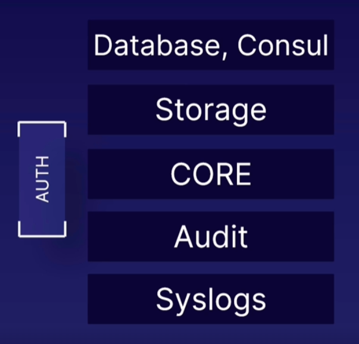

# HashiCorp Vault
HashiCorp Vault is a tool used to store, process, and manage any kind of credentials. It replaces traditional databases for user credentials.

### Contact details
|||
|---|---|
|Slack Live Chat| `@ Erman Kreponic`|
|E-mail| `ermin.kreponic@acloud.guru`|

### About the course
HashiCorp Vault is a tool that is used to store, process, and generally manage any kind of credentials. It removes the need for traditional databases that are used to store user credentials. Even though it provides storage for credentials, it also provides many more features. You are able to create and revoke secrets, grant time-based access, IP-based access, and much more. <br><br>
As part of this course, we will get acquainted with HashiCorp Vault and its features. We will see and examine the life cycle of a secret: How is it created? Where does it exist? Of what type is it? For AWS, GCP, Azure? HashiCorp Vault has specific predefined types of secrets that work well with existing cloud service providers.<br><br>
Vault provides you with the ability to clearly and precisely define who can access which secret and what sort of access they will have. Do you want the user to only be able to read the credentials, or can the user update them? All of these actions can be logged, and you will be able to see who accessed what and when at all times.<br><br>
The course will begin with a light introduction to HashiCorp Vault, taking a look at the high-level architecture and then progressing slowly over to basic command-level interaction. Once we learn how to install, configure, and interact with the tool, we will move on to performing specific tasks and reviewing real world scenarios.<br><br>
It would be impossible to demonstrate all the possible scenarios, but the most common ones will be included such as configuring Vault to work with SSH and provide access, setting up Vault to work with GCP and create GCP-type secrets, and setting up Vault to work with MySQL databases. There will also be an opportunity to analyze how Vault can be easily integrated into third-party custom applications for which there are no specific types of secrets.

<br>

## Course Outline

### General Overview
- What Is HashiCorp Vault?
- What Problems Does HashiCorp Vault Solve and Where Is It Used?
- Overview of High-Level Architecture

### Install HashiCorp Vault and Configure HashiCorp Vault Shell
- Installing HashiCorp Vault on Linux Part 1
- Installing HashiCorp Vault on Linux Part 2
- Installing HashiCorp Vault on Linux Part 3
- Installing HashiCorp Vault on Linux Part 4
- Installing HashiCorp Vault on Windows (This will be demonstrated but not used)
- `HANDS-ON LAB` Install and Configure HashiCorp Vault on Linux

### HashiCorp Vault Web-Based User Interface
- Overview of HashiCorp Vault Web UI

### HashiCorp Vault Authentication, Secrets, and Tokens
- Overview and Usage of HashiCorp Vault Secrets Engine
- Write, Get, and Delete a Secret
- Overview and Usage of Dynamic Secrets GCP - Part 1
- Overview and Usage of Dynamic Secrets GCP - Part 2
- Authentication and Tokens
- Username and Password Authentication
- GitHub Authentication
- `HANDS-ON LAB` Configure Authentication with HashiCorp Vault

### HashiCorp Vault Policies
- Overview of Policy Formats
- Writing and Testing Sentinel Policies
- Writing and Testing ACL Policies Example 1
- Writing and Testing ACL Policies Example 2
- `HANDS-ON LAB` Write and Test a HashiCorp Vault Policy

### Overview of HashiCorp Vault Application Programming Interface - API
- Using HashiCorp Vault REST API Part 1
- Using HashiCorp Vault REST API Part 2
- `HANDS-ON LAB` Configure and Test HashiCorp Vault REST API

### Secure Shell Authentication with HashiCorp Vault
- Authenticate to SSH via HashiCorp Vault Part 1
- Authenticate to SSH via HashiCorp Vault Part 2
- Authenticate to SSH via HashiCorp Vault Part 3
- `HANDS-ON LAB` Configure SSH for HashiCorp Vault Authentication

### Creating Logs and Managing Logging
- Configure and Test Logging for HashiCorp Vault Part 1 - Server Logs
- Configure and Test Logging for HashiCorp Vault Part 2 - File Logs
- Configure and Test Logging for HashiCorp Vault Part 3 - rsync
- `HANDS-ON LAB` Implement a Logging Solution for HashiCorp Vault

### Authenticate a User to a Website via Vault
- HashiCorp Vault Website User Authentication Part 1
- HashiCorp Vault Website User Authentication Part 2
- HashiCorp Vault Website User Authentication Part 3
- `HANDS-ON LAB` Integrating HashiCorp Vault Authentication to a Website

### Authenticate to Application API via Vault
- Authenticate to Application REST API via HashiCorp Vault Part 1
- Authenticate to Application REST API via HashiCorp Vault Part 2
- Authenticate to Application REST API via HashiCorp Vault Part 3
- `HANDS-ON LAB` Implement HashiCorp Vault API Authentication

### Database Authentication via HashiCorp Vault
- Configure HashiCorp Vault Authentication to a MariaDB Part 1
- Configure HashiCorp Vault Authentication to a MariaDB Part 2
- Configure HashiCorp Vault Authentication to a MariaDB Part 3
- `HANDS-ON LAB` Implement HashiCorp Vault Authentication to MariaDB

### Authenticate an IAM User via Vault
- IAM User Authentication with HashiCorp Vault Part 1
- IAM User Authentication with HashiCorp Vault Part 2
- IAM User Authentication with HashiCorp Vault Part 3


<br><br><br>

## What is HashiCorp Vault

HashiCorp Vault is a popular open-source tool designed for securely storing, managing, and controlling access to sensitive data and secrets in modern computing environments. It provides a centralized platform for managing secrets such as passwords, API keys, encryption keys, and certificates, ensuring their secure storage, access, and dynamic rotation.

**Key features of HashiCorp Vault include:**

- **Secret Management:** <br>Vault enables organizations to securely store and manage sensitive data and secrets in a centralized repository, reducing the risk of exposure and unauthorized access.

- **Dynamic Secrets:** <br>It allows for the dynamic generation of secrets on-demand, providing a higher level of security by limiting the lifespan and scope of access for secrets.

- **Encryption as a Service:** <br>Vault provides encryption and decryption services, allowing applications to encrypt and decrypt data securely without directly handling encryption keys.

- **Access Control Policies:** <br>Vault offers fine-grained access control mechanisms through policies, allowing administrators to define who can access which secrets and under what conditions.

- **Secret Rotation:** <br>Vault supports automatic and manual rotation of secrets, ensuring that cryptographic keys and other sensitive data are regularly updated to mitigate security risks.

- **Auditing and Logging:** <br>Vault logs all access and operations, providing a detailed audit trail for compliance and troubleshooting purposes.

- **Integration with Cloud Platforms:** <br>Vault seamlessly integrates with popular cloud platforms, container orchestration systems, and identity providers, allowing organizations to leverage its capabilities in diverse environments.

- **High Availability:** <br>Vault supports high availability configurations, ensuring continuous access to secrets and minimizing downtime in mission-critical environments.


<br>

### Additional Resources
- **HashiCorp Vault website** <br> https://www.vaultproject.io
- **Official Documentation** <br> https://www.vaultproject.io/docs
- **Non-Enterprise vs Enterprise** <br> https://www.hashicorp.com/products/vault/pricing


### Use Cases

- **Secrets Management**<br> Vault provides a secure and centralized platform for storing, managing, and distributing sensitive data and secrets such as passwords, API keys, tokens, and certificates.

- **Secure Application Authentication**<br> Vault can authenticate applications and services securely, allowing them to obtain access tokens or temporary credentials for accessing other services and resources.

- **Encryption as a Service**<br> Vault offers encryption and decryption services, enabling applications to encrypt and decrypt data securely without directly managing encryption keys.

- **Dynamic Secrets Provisioning**<br> Vault can dynamically generate and manage secrets on-demand, providing short-lived credentials or tokens for accessing databases, cloud services, and other resources.

- **Credential Management**<br> Vault helps organizations securely manage and distribute credentials and access tokens for various systems, databases, cloud providers, and third-party services.

- **Secure Key Management**<br> Vault serves as a secure key management solution, allowing organizations to generate, store, and rotate cryptographic keys for encryption, digital signatures, and secure communication.

- **Data Protection and Compliance**<br> Vault helps organizations comply with data protection regulations and industry standards by securely managing sensitive data, maintaining audit trails, and enforcing access controls.

- **Secrets Rotation**<br> Vault supports automatic and manual rotation of secrets, ensuring that cryptographic keys, passwords, and other sensitive data are regularly updated to mitigate security risks.

- **Secure Service-to-Service Communication**<br> Vault facilitates secure communication between microservices and distributed systems by providing mutual TLS (mTLS) authentication, encryption, and certificate management.

- **Multi-Cloud Secrets Management**<br> Vault supports deployment across multiple cloud providers and environments, allowing organizations to manage secrets consistently and securely across hybrid and multi-cloud infrastructures.

- **Infrastructure Automation and Orchestration**<br> Vault integrates with infrastructure automation and orchestration tools such as Terraform, Kubernetes, and Ansible, enabling automated provisioning, configuration, and management of secrets and infrastructure resources.

- **Zero Trust Security**<br> Vault aligns with zero trust security principles by enforcing strict access controls, minimizing the exposure of secrets, and dynamically generating and revoking access credentials based on policies and authentication factors.

<br>

### Overview of High-Level Architecture



- **Auth**

    Vault supports various authentication methods to verify users and services before granting access.
    Examples of authentication methods include token-based authentication, username/password authentication, LDAP, Active Directory, AWS IAM, Kubernetes, and more.

- **Database & Consul**

    Vault can integrate with databases for data storage and utilize Consul for distributed storage and service discovery.
    Vault can leverage databases (such as PostgreSQL, MySQL, or MongoDB) to store its data, including secrets, encryption keys, and audit logs.
    Consul, another product by HashiCorp, can serve as a highly available and distributed storage backend for Vault, providing scalability, fault tolerance, and dynamic service discovery.

- **Storage**

    Vault employs different storage backends for persistent data storage, offering flexibility based on requirements. Vault supports various storage backends, including Consul, etcd, Amazon DynamoDB, Google Cloud Storage (GCS), and more.

- **CORE**

    The core components of Vault handle critical functions such as secrets management, access control, and encryption.

- **Audit**

    Vault provides audit logging to record important events for compliance and security purposes. Vault can log audit events to various destinations, including local files, syslog, standard output, and external logging services such as Splunk, Elasticsearch, or AWS CloudWatch.

- **Syslogs**

    Integration with syslog enables centralized logging of Vault's activity for monitoring and analysis.


<br><br>

## Install HashiCorp Vault and Configure HashiCorp Vault Shell<br><br> Installing HashiCorp Vault on Linux

### Part 1 (Consul installation)
- Download Consul

    `wget https://releases.hashicorp.com/consul/1.7.3/consul_1.7.3_linux_amd64.zip`

- Unpack Consul

    `unzip conosul_1.7.3_linux_amd64.zip`

- Change the file location

    `sudo mv consul /usr/bin/`

- Run test to verify that it works

    `consul --version`

### Part 2 
- Consul systemd file

    `sudo vim /etc/systemd/system/consul.service`

- Configuration files

    ```ini
    [Unit]
    Description=Consul
    Documentation=https://www.consul.io/
    [Service]
    ExecStart=/usr/bin/consul agent -server -ui -data-dir=/temp/consul -bootstrap-expect=1 -node=vault -bind=IP.ADDRESS.OF.SERVER -config-dir=/etc/consul.d/
    ExecReload=/bin/kill -HUP $MAINPID
    LimitNOFILE=65536
    [Install]
    WantedBy=multi-user.target
    ```
    > ***Note:***<br> In the lab `-bind=IP.ADDRESS.OF.SERVER` was set to `-bind=172.31.109.145`

- Configuration for UI

    ```shell
    sudo mkdir /etc/consul.d
    sudo vim /etc/consul.d/ui.json
    ```

    `ui.json`
    ```json
    {
        "address": {
            "http": "0.0.0.0"
        }
    }
    ```


- Confirm and test out systemd configuration

    Restart daemon

    `sudo systemctl daemon-reload`

    Check status
    
    `sudo systemctl status consul`

    Start consul
    
    `sudo sytemctl start consul`

    Enable Consul
    
    `sudo systemctl enable consul`

    Check Consul logs

    `sudo journalctl -f -u consul`


